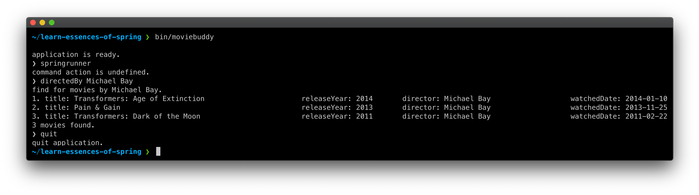

# Learn Essence of Spring Template

본 프로젝트는 Learn Essence of Spring 워크숍(강좌)에서 사용할 템플릿 프로젝트입니다. 

---

## MovieBuddy



여기 순수 자바로 작성된 콘솔 애플리케이션이 있습니다. 보시는 것처럼 그래픽 유저 인터페이스가 없습니다. 검은 바탕에 흰 글자로 구성된 콘솔 창에서 명령 프롬프트를 통해 명령어를 입력하면, 그에 해당하는 동작을 수행하고 결과를 텍스트로 출력합니다.

이 애플리케이션은 잘 동작하고 있지만, 코드에서 나쁜 악취가 많이 나고 있습니다. 이 와중에 몇 가지 기능을 더 추가해야 합니다. 워크숍(강좌) 과정에서 이 콘솔 애플리케이션에 스프링 프레임워크를 도입하고, 리팩토링을 통해 점진적으로 코드를 개선해볼 것입니다.

### 빌드 및 실행 방법
저장소를 복제하거나 압축 파일로 내려받은 받은 후 다음 명령어를 통해 애플리케이션을 빌드하고, 실행할 수 있습니다.
```
$❯ ./gradlew clean build
$❯ unzip build/distributions/moviebuddy.zip -d build/
$❯ build/moviebuddy/bin/moviebuddy
```

### 사용법
```
// 감독으로 영화 검색하기
❯ directedBy Michael Bay

// 개봉연도로 영화 검색하기
❯ releasedYearBy 2015

// 애플리케이션 종료하기
❯ quit
```

### 개발환경
- Java SE 11
- Gradle 6.6

---

워크숍(강좌)에 대한 자세한 소개는 [여기](https://springrunner.dev/training/learn-essence-of-spring-workshop/)에서 볼 수 있습니다.